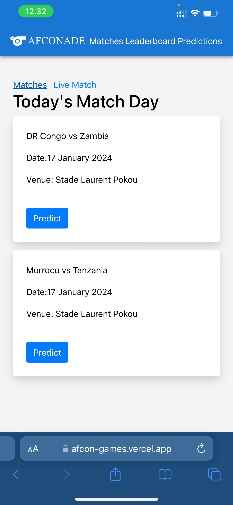
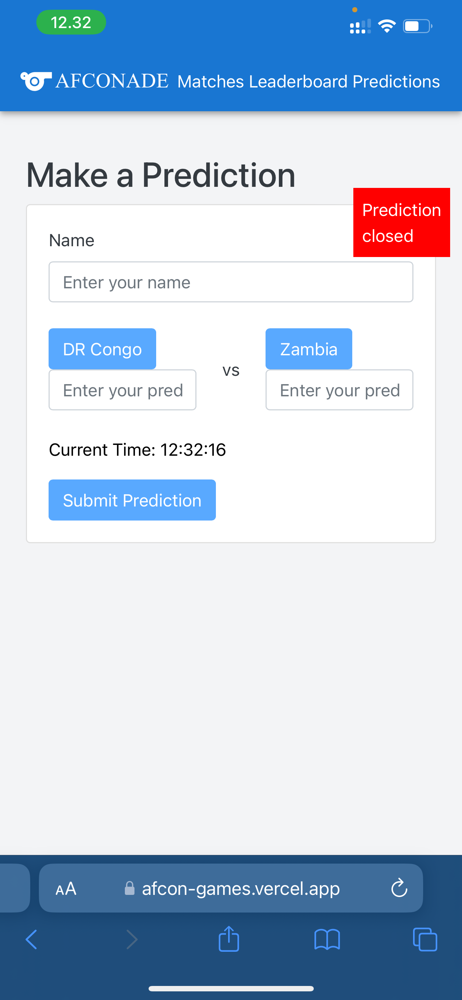
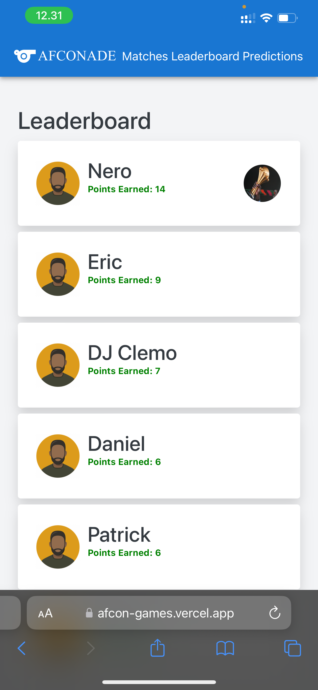
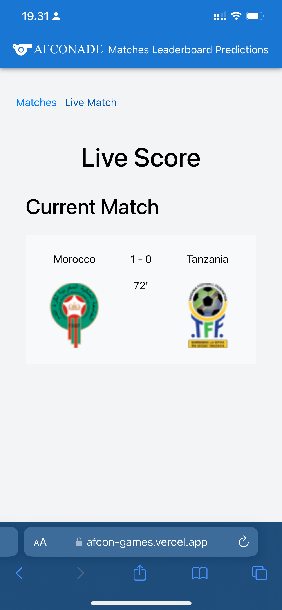

# Afconade Prediction Game App

The Afconade Prediction Game App is a platform designed for friends and family to engage in a friendly prediction competition, where users predict the scores of upcoming matches and earn points based on the accuracy of their predictions. The user with the highest points at the end of the tournament is declared the winner.

## Features

### Matches

- View all current and available matches for prediction on a given day.
- Predict scores for matches before the 12:00 pm deadline.

### Leaderboard

- Displays a leaderboard showcasing users and their respective scores in descending order.
- The user with the highest score is positioned at the top.

### Live Matches

- Real-time display of current match results.
- Provides users with up-to-date information on live match scores.

### Predictions

- View predictions made by users for a specific day.
- Access a comprehensive list of all predictions made in the game.

## Future Plans

- **Custom Sessions**: Allow different groups to create their own prediction sessions, enabling them to play different games such as the Euro Cup, South American Cup, Asian Cup, and more.

The Afconade Prediction Game App is continuously evolving to provide an enhanced user experience, with plans for additional features and customization options in the future. Feel free to explore the current features and stay tuned for exciting updates!

